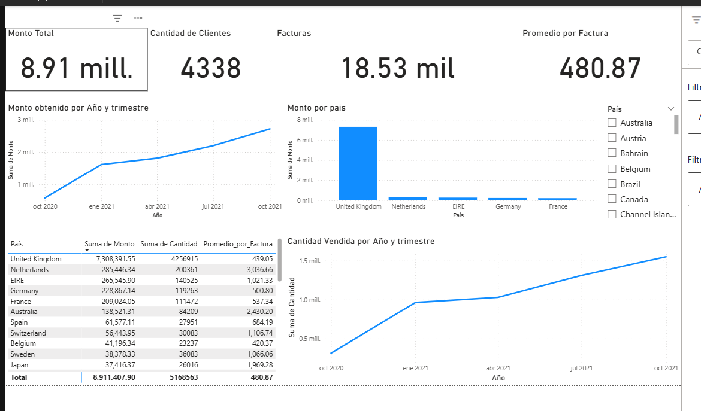
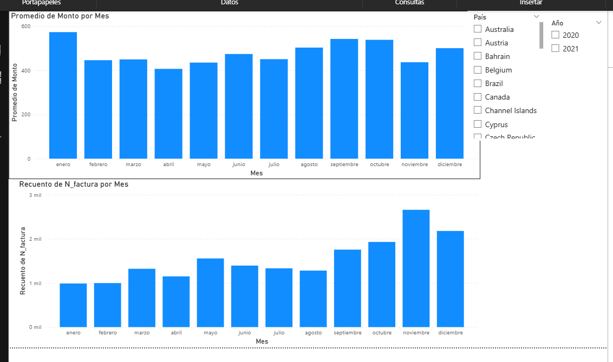
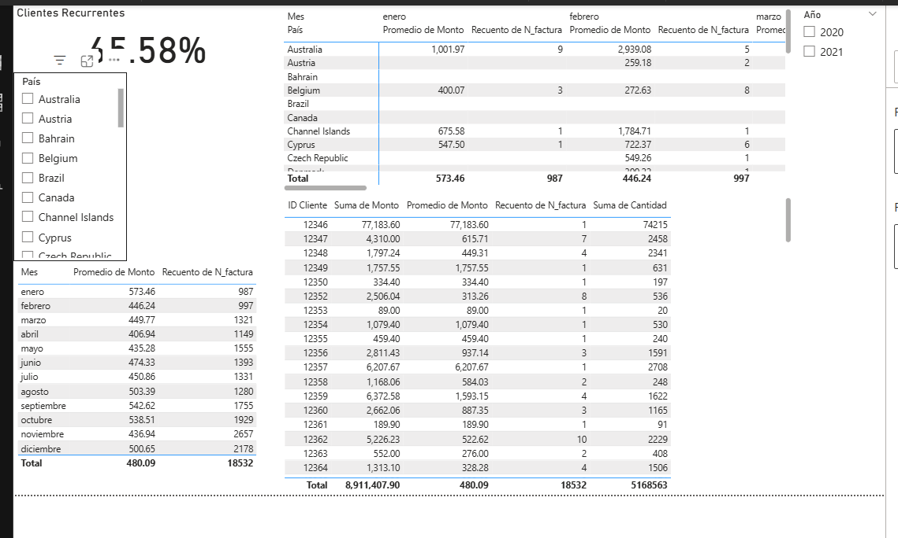
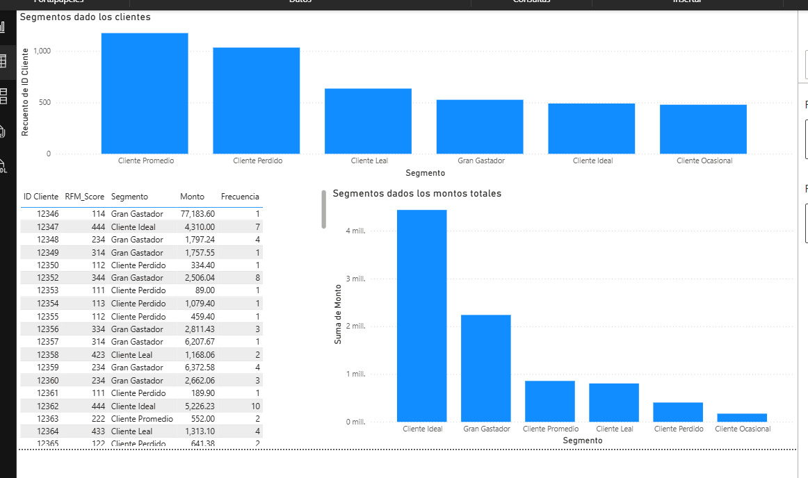

# 📊 Análisis de Clientes y Ventas 

Este proyecto combina **Python** y **Power BI** para analizar las ventas de la empresa mayorista de ropa . El objetivo es apoyar decisiones estratégicas basadas en datos mediante limpieza, exploración, retención de clientes y segmentación de comportamiento de compra.

## 🧰 Herramientas Utilizadas

- 🐍 **Python** (Pandas, Seaborn, Matplotlib)
- 📊 **Power BI Desktop**
- archivo de datos obtenido de kaggle

## 🧪 Pasos del Análisis

1. **Revisión de Calidad de Datos en python** 
   - Detección y eliminación de duplicados, valores faltantes y montos/cantidades inválidas.
   - Conversión de formatos de fecha, ID y monto.

2. **Análisis de Cohortes en python**
   - Identificación de mes de primera compra.
   - Cálculo de retención mensual.

3. **Exportacion de los archivos con los datos limpios y los datos para el rfm que trabajaremos en power bi**

4. **Análisis Exploratorio**
   - Métricas clave: total de ventas, clientes únicos, productos más vendidos.
   - Tendencia mensual y análisis por país.

5. **Segmentación RFM**
   - Cálculo de Recencia, Frecuencia y Monto por cliente.
   - Creación de scores por cuartiles.
   - Clasificación de clientes: “Cliente Ideal”, “Gran Gastador”, “Leal”, “Perdido”, entre otros.
   - Análisis Pareto: el 20% de los clientes genera la mayor parte de los ingresos.

6. **Visualización en Power BI**
   - Creación de dashboards interactivos con KPIs, filtros y vistas por vendedor, país y categoría como la segmentacion por rfm.

---

## 📊 Paneles de Power BI

## 📌 1. Indicadores Generales y Ventas por País

> KPIs clave (ventas totales, clientes, facturas), junto con la distribución de ventas por país. 

---

## 📅 2. Evolución Mensual de Facturación

> Gráficos que muestran cómo varía el monto promedio por factura y la cantidad de facturas mensuales. Útil para detectar estacionalidad y tendencias de crecimiento.

---

## 🔁 3. Clientes Recurrentes

> Análisis que revela qué porcentaje de clientes volvió a comprar (recompra del 45.58%). Incluye desglose mensual por cliente para identificar patrones de fidelidad.

---

## 👥 4. Segmentación de Clientes (RFM)

> Clasificación de clientes según Recencia, Frecuencia y Monto. Permite priorizar campañas y acciones comerciales enfocadas en los segmentos más valiosos.

## 🚀 Autor

**Diego Arroyo**  
📧 diegojulioarroyo@email.com  
🔗 [Mi LinkedIn](https://www.linkedin.com/in/diego-arroyo-b2153b229/) 
